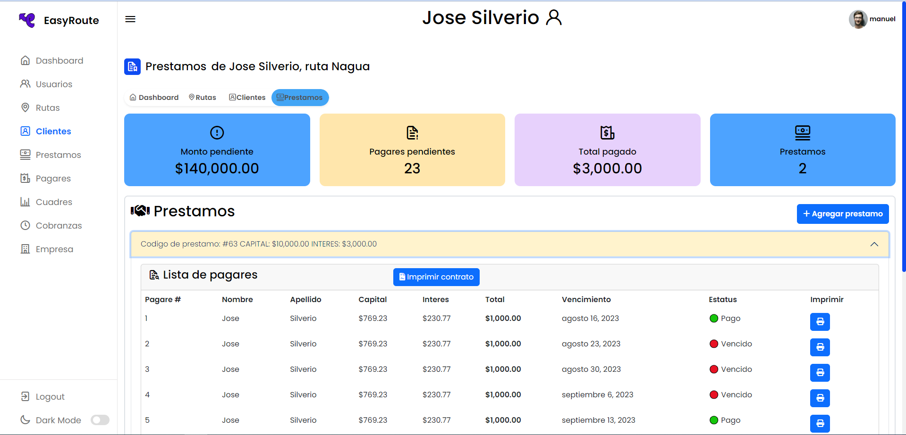

  <h1>EasyRoute</h1>
  <h3>An efficient loan management solution for streamlined loan processes and customer evaluation.</h3>

<!--

  

  

  

  

  

  

  

-->

  <a href="#dart-about">About</a> &#xa0; | &#xa0;
  <a href="#rocket-main-technologies">Technologies</a> &#xa0; | &#xa0;
  <a href="#white_check_mark-requirements">Requirements</a> &#xa0; | &#xa0;
  <a href="#checkered_flag-starting">Starting</a> &#xa0; | &#xa0;
  <a href="https://github.com/ManuelMatancero/loan-route-management-app">Contributing</a>

## :dart: About

EasyRoute is a modern and intuitive application developed to efficiently manage loan requests, streamline the customer registration and evaluation process, and monitor and approve loans, among other functionalities.

The application provides a comprehensive and scalable solution that meets the changing needs of loan route companies while enhancing customer satisfaction. It offers advanced online platforms to optimize the loan process, allowing for efficient management of loan requests, accurate interest rate calculations, and effective decision-making tools for loan evaluation.

## :rocket: Main Technologies

☕️Java, 🍃Spring Boot, 🔐Spring Security, 💤Hibernate, 🧱JPA, 📄MySQL, 🚀Bootstrap, 🌐HTML, 💮Thymeleaf, ⚡️JavaScript y 🎨CSS

## :white_check_mark: Requirements

...

## :checkered_flag: Starting

...

## :memo: License

...

## 👨🏻‍🚀 Developers

### Frainer Encarnacion 
### Manuel Sarante

## Images

